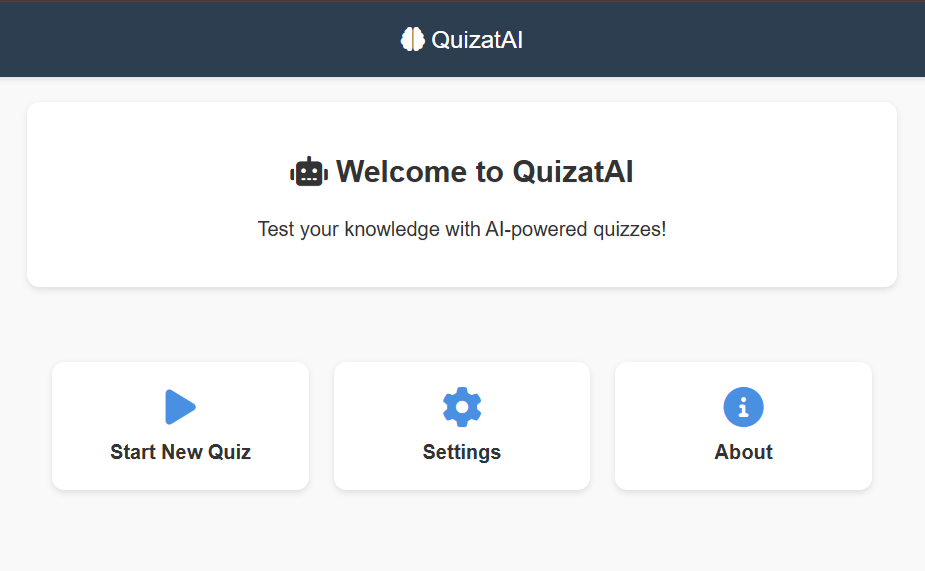
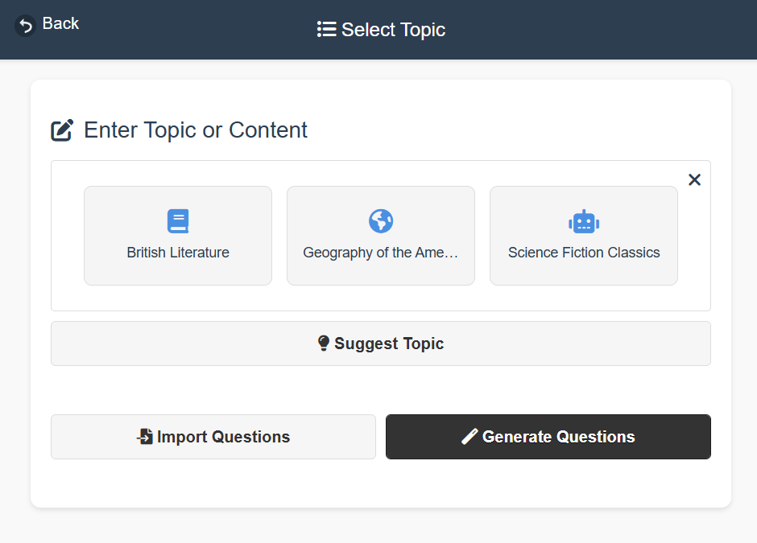
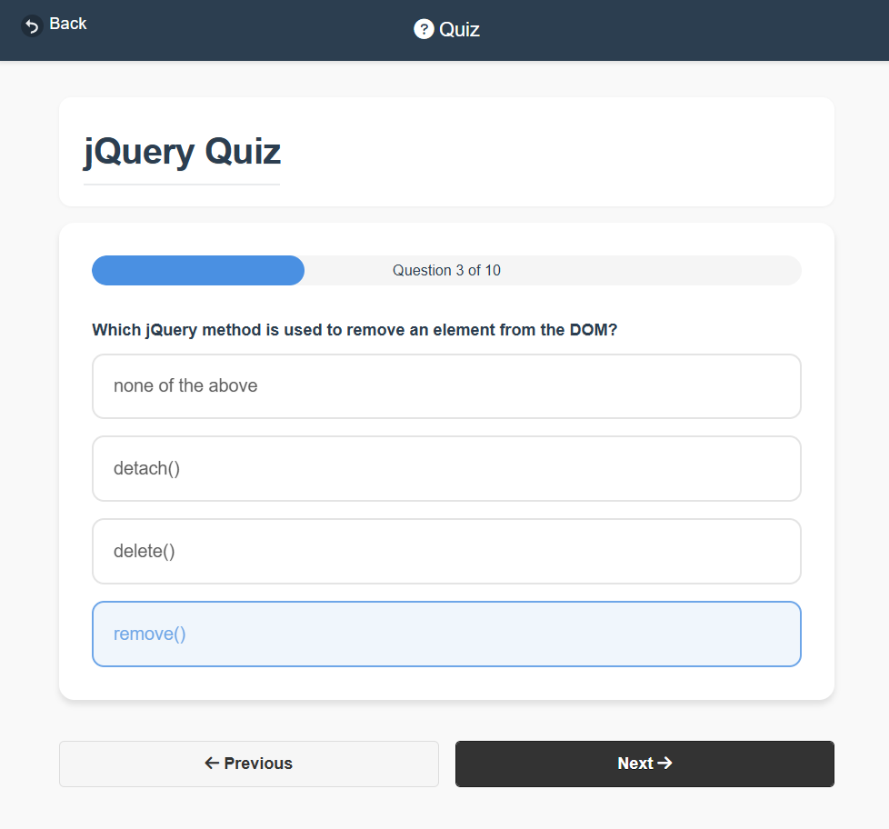
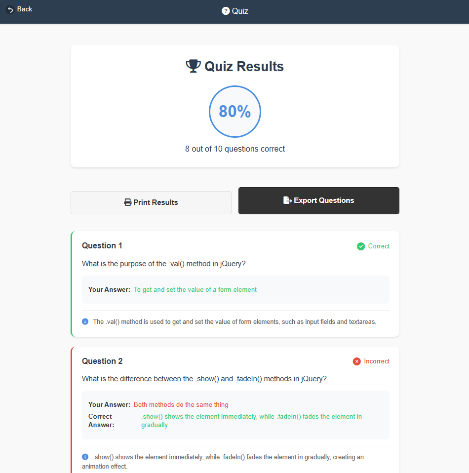

# QuizatAI 🧠

<div align="center">

[](https://opensource.org/licenses/MIT)
[](https://github.com/Omar7001-B/QuizatAI/stargazers)

> Transform any topic into an engaging quiz with AI-powered question generation

[Live Demo](https://omar7001-b.github.io/QuizatAI/) • [Report Bug](https://github.com/Omar7001-B/QuizatAI/issues) • [Request Feature](https://github.com/Omar7001-B/QuizatAI/issues)

</div>

## ✨ Features

- 🤖 **AI-Powered**: Generate engaging questions from any topic
- 📊 **Smart Review**: Immediate feedback or end-of-quiz review
- ⚙️ **Customizable**: Timer, randomization, and question count
- 💾 **Import/Export**: Share quizzes in JSON format

## 📸 Screenshots

<div align="center">
<table>
<tr>
<td width="50%">
<p align="center"><strong>Home Screen</strong></p>

</td>
<td width="50%">
<p align="center"><strong>Topic & Generation</strong></p>

</td>
</tr>
<tr>
<td width="50%">
<p align="center"><strong>Quiz Interface</strong></p>

</td>
<td width="50%">
<p align="center"><strong>Results Analysis</strong></p>

</td>
</tr>
</table>
</div>

## 🚀 Quick Start

```bash
# Clone repository
git clone https://github.com/Omar7001-B/QuizatAI.git

# Open with live server
# Use VS Code's Live Server extension
```

## 💻 Technologies

- Frontend: HTML5, CSS3, JavaScript (ES6+)
- UI: jQuery Mobile, Font Awesome
- Integration: Custom AI Models

## 👤 Author

**Omar Adel** - [@Omar7001-B](https://github.com/Omar7001-B)

---

<div align="center">
⭐️ Star if you found this helpful!

Made with ❤️ by Omar Adel
</div> 