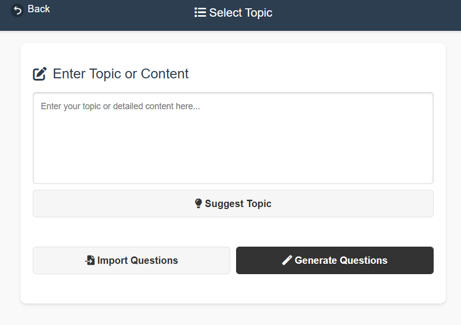
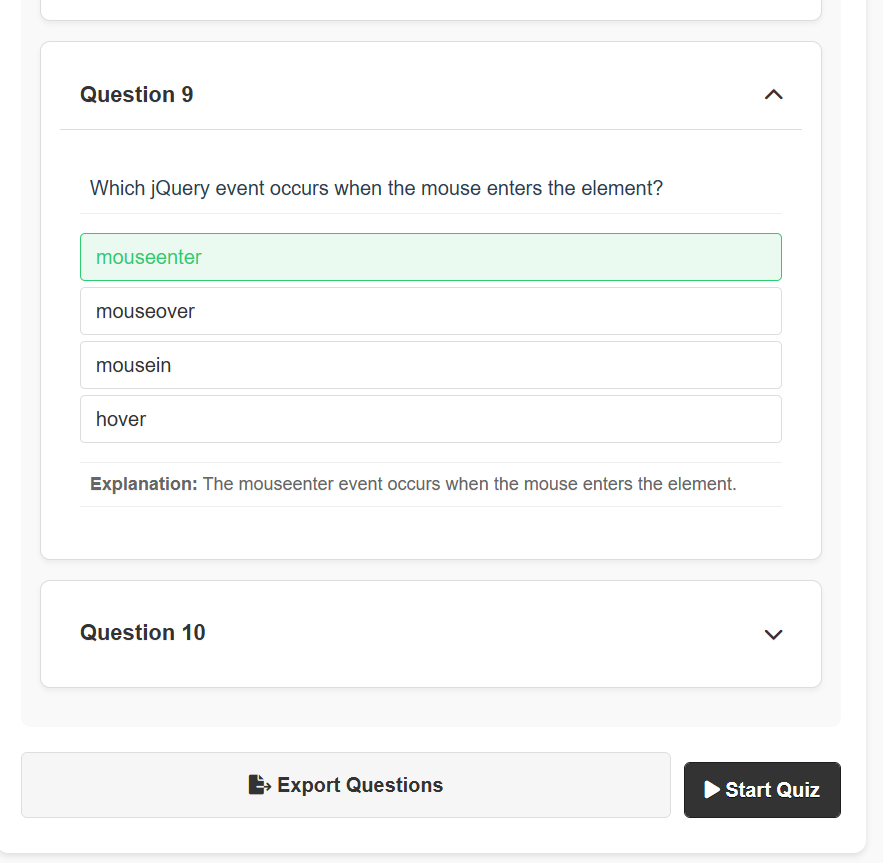
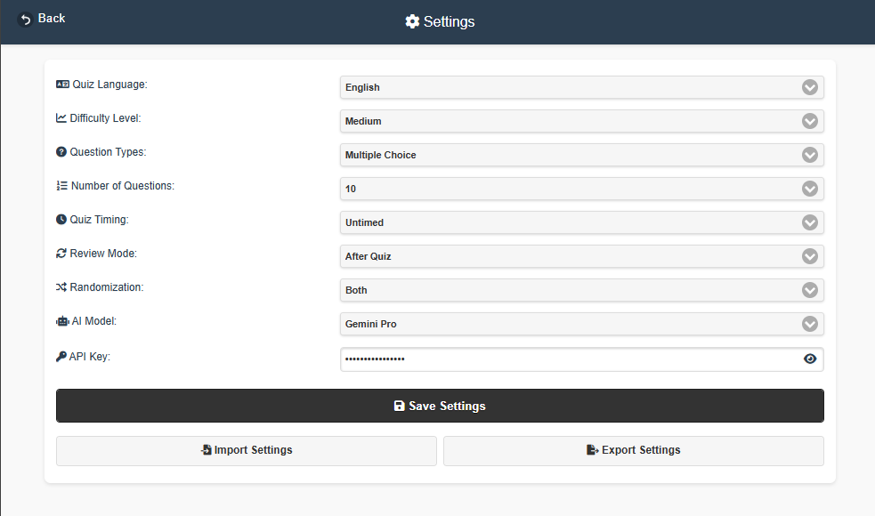
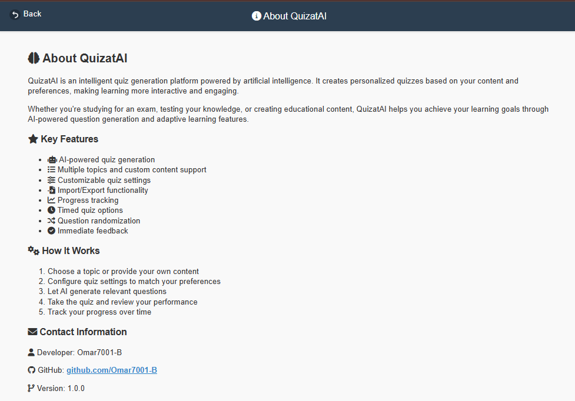

# QuizatAI 🧠

<div align="center">

[](https://opensource.org/licenses/MIT)
[](https://github.com/Omar7001-B/QuizatAI/stargazers)
[](https://github.com/Omar7001-B/QuizatAI/network/members)

> A modern, AI-powered quiz application that transforms any topic into an engaging learning experience.

[Live Demo](https://omar7001-b.github.io/QuizatAI/) | [Report Bug](https://github.com/Omar7001-B/QuizatAI/issues) | [Request Feature](https://github.com/Omar7001-B/QuizatAI/issues)

</div>

## 🌟 Overview

QuizatAI is an intelligent quiz application that leverages AI to generate personalized quizzes from any topic or content. With features like immediate feedback, customizable settings, and detailed analytics, it provides an engaging learning experience for users.

## ✨ Key Features

| Feature | Description |
|---------|-------------|
| 🤖 **AI Generation** | Convert any topic into engaging quiz questions instantly |
| 🎯 **Smart Topics** | Get intelligent topic suggestions based on your interests |
| 📊 **Review Modes** | Choose between immediate feedback or end-of-quiz review |
| ⚙️ **Customization** | Control timing, randomization, and question count |
| 📱 **Responsive UI** | Beautiful interface that works on all devices |
| 📈 **Analytics** | Detailed performance tracking and question analysis |
| 💾 **Import/Export** | Share quizzes easily in JSON format |

## 📸 Screenshots

| Page | Screenshot | Description |
|------|------------|-------------|
| 🏠 Home |  | Modern landing page with quick navigation tiles |
| 🎯 Topic Entry |  | Clean interface for entering quiz topics |
| ✨ Generation |  | AI-powered question generation in action |
| 📝 Questions |  | Preview and manage generated questions |
| 📋 Quiz |  | Interactive quiz-taking experience |
| 📊 Results |  | Detailed performance analysis and review |
| ⚙️ Settings |  | Customize quiz preferences and options |
| ℹ️ About |  | Information about QuizatAI and its features |

## �� Getting Started

1. **Visit the Application**
   ```
   https://omar7001-b.github.io/QuizatAI/
   ```

2. **Create Your Quiz**
   - Enter your topic or paste content
   - Click "Generate Questions" or import existing ones
   - Customize quiz settings
   - Start learning!

## 💻 Technologies

| Category | Technologies |
|----------|-------------|
| Frontend | HTML5, CSS3, JavaScript (ES6+) |
| UI Framework | jQuery Mobile |
| Icons | Font Awesome |
| AI Integration | Custom AI Models |

## 🛠️ Development Setup

```powershell
# Clone the repository
git clone https://github.com/Omar7001-B/QuizatAI.git

# Navigate to project directory
cd QuizatAI

# Open with live server
# Use VS Code's Live Server extension or any HTTP server
```

## 🤝 Contributing

We welcome contributions! Here's how you can help:

1. Fork the repository
2. Create your feature branch
   ```powershell
   git checkout -b feature/AmazingFeature
   ```
3. Commit your changes
   ```powershell
   git commit -m 'feat: add amazing feature'
   ```
4. Push to the branch
   ```powershell
   git push origin feature/AmazingFeature
   ```
5. Open a Pull Request

## 📄 License

This project is licensed under the MIT License - see the [LICENSE](LICENSE) file for details.

## 👤 Author

**Omar Adel**
- GitHub: [@Omar7001-B](https://github.com/Omar7001-B)

## 🌟 Support

If you find this project helpful, please consider giving it a ⭐️. It helps others discover the project and motivates further development.

---

<div align="center">
Made with ❤️ by Omar Adel
</div> 